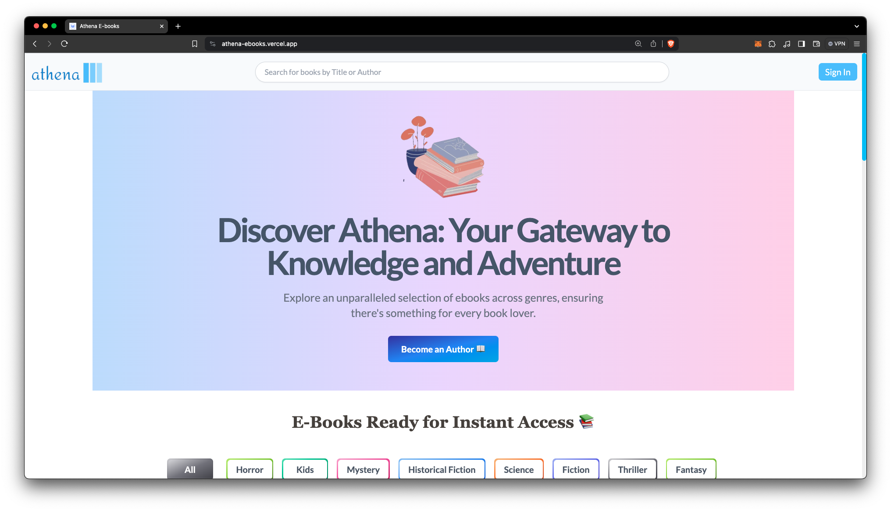

<h1 align="center">
  Athena Ebooks 📚
</h1>

> A modern platform built with Next.js, GraphQL, and MongoDB to read, write, and download Ebooks. Anytime, Anywhere

---

### Key Features 📋

- [x] User **Authentication**
- [x] **Explore Ebooks**
- [x] **Write** your own Ebooks
- [x] **Upload** & **Download** (PDF format)
- [x] **Save Favorite** Ebooks
- [x] **Search** & **Filter** Ebooks
- [x] **Mobile Responsive** Design

---

### Important Links 🔗

- [Setup Guide](./docs/SETUP.md)
- [Frontend](./docs/FRONTEND.md)
- [Database Schema](./docs/SCHEMA.md)

---

### Tools and Technologies 🛠️

**Frontend**
- **Framework**: Next.js 14 (React.js)
- **Language**: Typescript
- **Authentication**: Nextauth
- **Styling**: Tailwind CSS + Shadcn UI
- **Testing**: Playwright
- **Deployment**: Vercel

**Backend**
- **Framework**: Node.js
- **Language**: Typescript
- **GraphQL**: Apollo Server
- **Database**: MongoDB
- **ORM**: Prisma
- **File Upload** + **Storage**: UploadThing
- **Mail Service**: Nodemailer
- **Deployment**: Vercel
---

### Best Practices Followed 📝

- [x] Robust Error Handling
- [x] Conventional Commit Messages
- [x] Comments to help support complex code logic
- [x] Linting & Formatting
