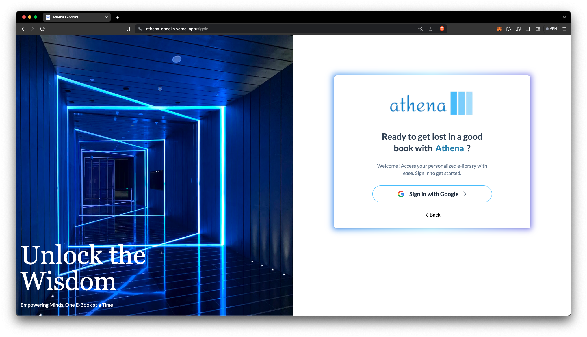
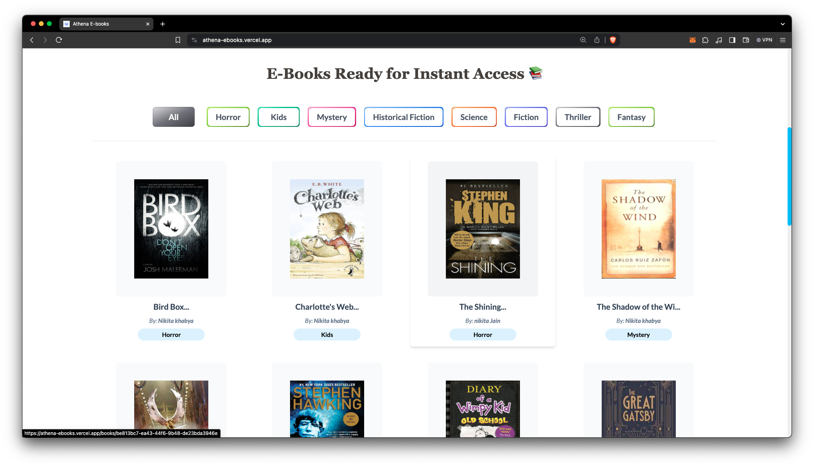
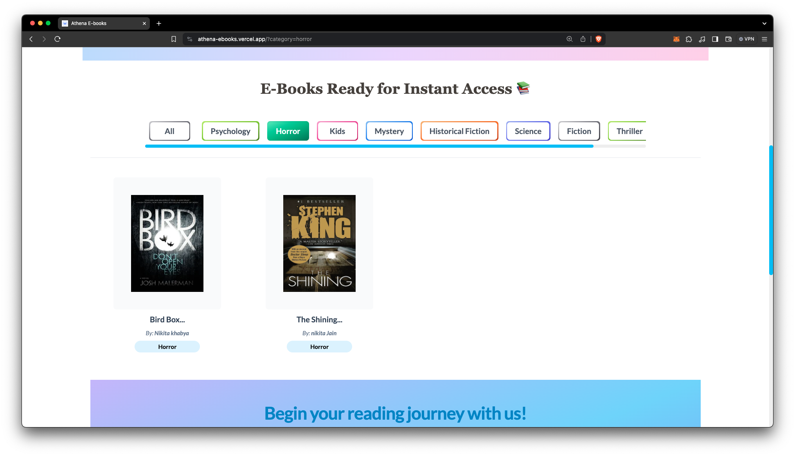
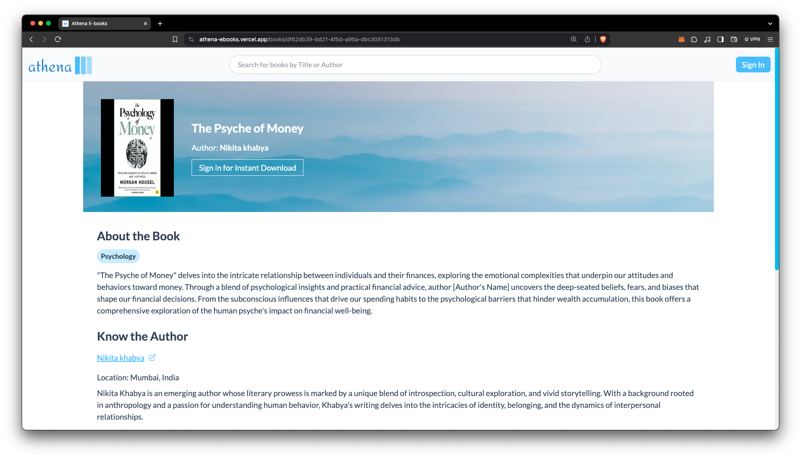
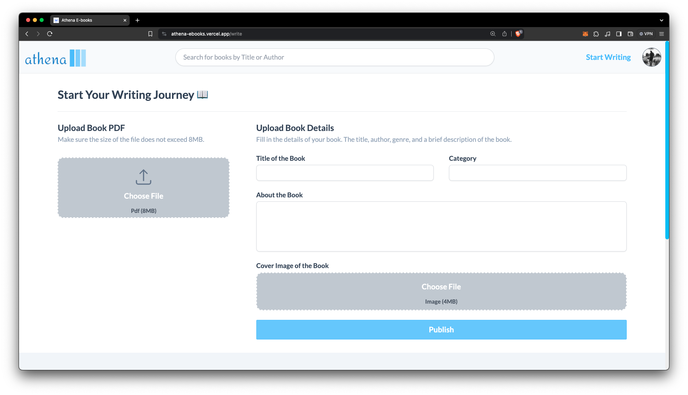
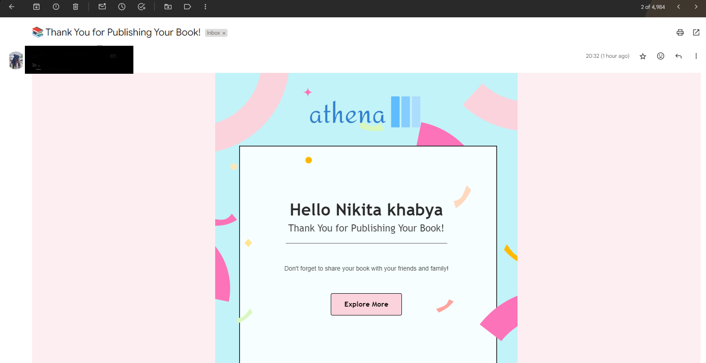
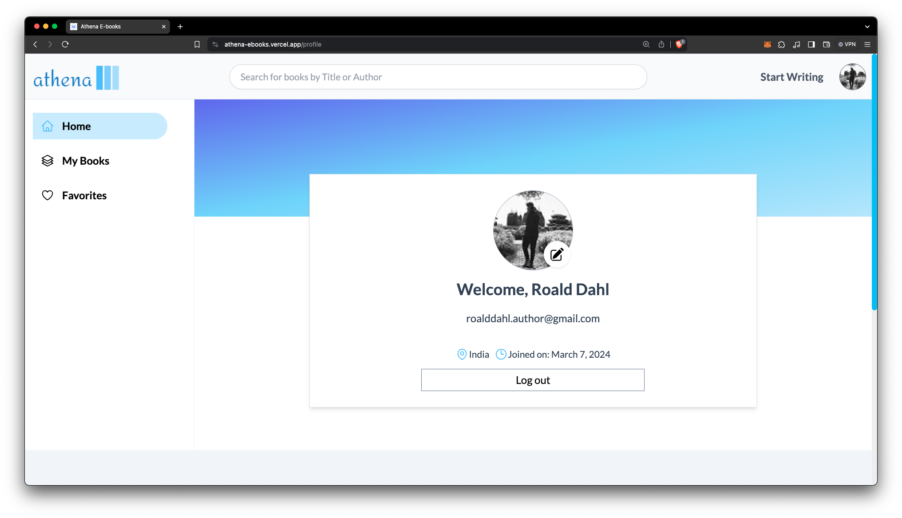
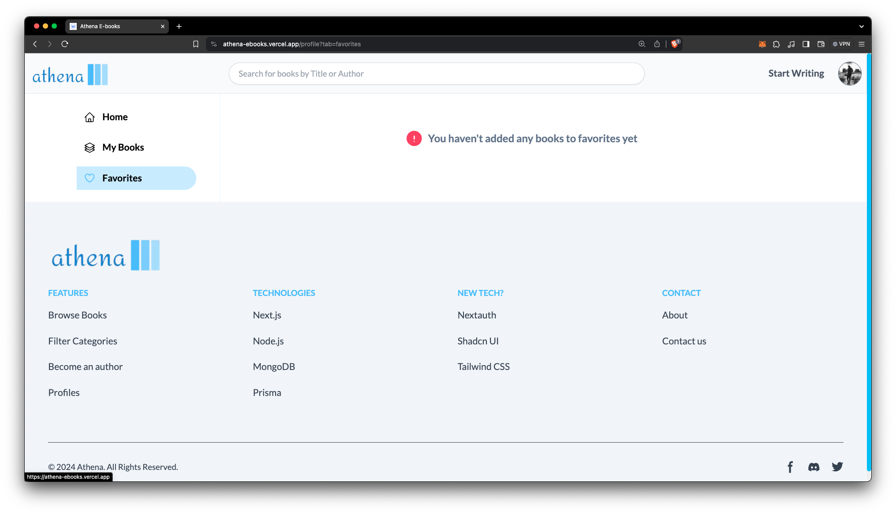
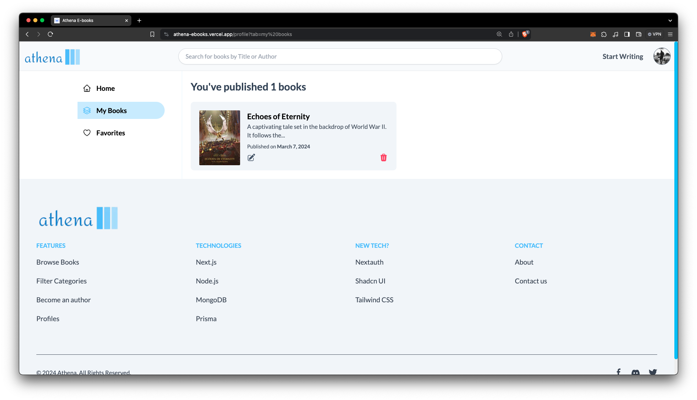

# Athena Ebooks
> This file explains the features and functionalities that the frontend of the application provides.

## Explore Books 📚

#### Features:

- [x] A **Books Listing** with ability to **search** by **Title** or **Author**
- [x] **Filter** books by **Categories**
- [x] View **Book Details**
- [x] **Download** books in PDF format
- [x] View other books by the same author  

#### Screenshots:

---

## Upload books ✍

#### Features:

- [x] Upload a book by adding book details such as **title** **category**, and **description**  
- [x] **Upload book cover image** & **book contents** in PDF format
  
#### Screenshot:

--- 
## Profile 🛠

#### Features:

- [x] View profile details
  - [x] **Update profile details** that will be reflected in the books you upload
- [x] View your books
  - [x] **Update** the details of your books
  - [x] **Remove** books from the system
- [x] **Add/Remove** books from **favorites**
  
#### Screenshot:

## Setup Guide
The setup guide for the application can be found in the [SETUP.md](./SETUP.md) file.