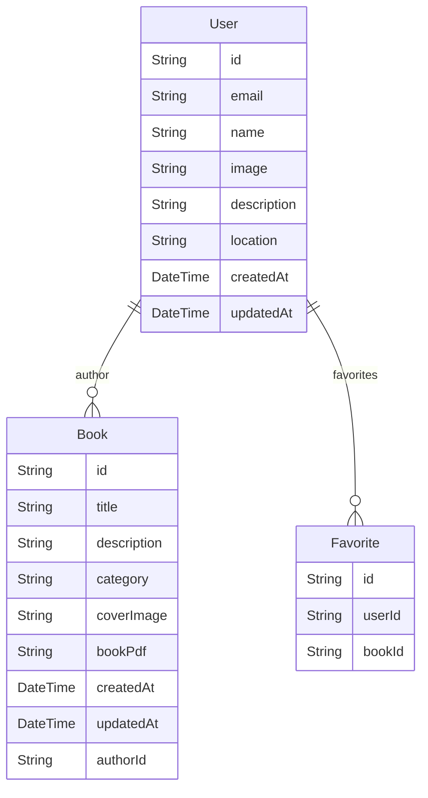

## Schema
> The schema for the MongoDB database is as follows:

```mermaid
erDiagram
  User {
    String id
    String email
    String name
    String image
    String description
    String location
    DateTime createdAt
    DateTime updatedAt
  }
  Book {
    String id
    String title
    String description
    String category
    String coverImage
    String bookPdf
    DateTime createdAt
    DateTime updatedAt
    String authorId
  }
  Favorite {
    String id
    String userId
    String bookId
  }
  User ||--o{ Book : "author"
  User ||--o{ Favorite : "favorites"
```

## Frontend 
The Frontend of the application can be found in the [FRONTEND.md](./FRONTEND.md) file.